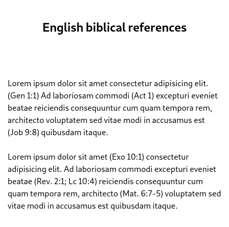
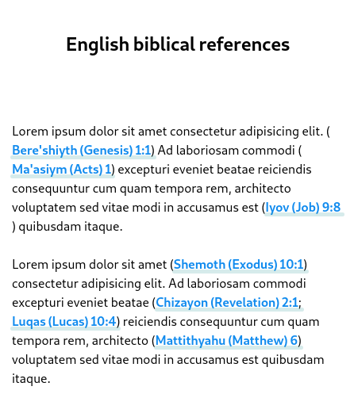

# To Ozzuu Bible

This is a userscript that allows you go to Ozzuu Bible in any biblical reference
in any site!

**to**

All verses are searched inside of `()`, `[]`, `{}`, `""` and `<>` [*](https://git.ozzuu.com/thisago/util/#func-getallenclosedtext-s-string-level-0-seq-tuple-chars-string-data-enclosedtext)

## Features

- Parses all found verses when pressing `F4`
- Optionally parses automatically all found verses
- Count how many verses was found

## Installation

1. Install a userscript manager like Violentmonkey
2. Open [build](https://git.ozzuu.com/thisago/toOzzuuBible/raw/branch/master/build/toOzzuuBible.user.js) on your browser
3. Confirm installation

## License

MIT
